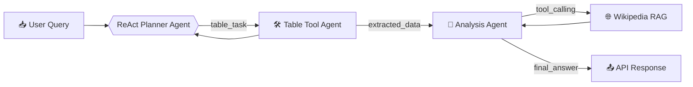

# HybridQA Multi-Agent System

<div align="center">
  
  
  
  
</div>

## Overview
Implements multi-hop question answering over tabular data and Wikipedia passages using LangGraph agents.

```diff
+ 70k Q-A pairs processing
+ 13k tables with linked Wikipedia passages
+ Multi-modal retrieval (structured + unstructured)
```

## Workflow  


### Docker Setup
```bash
cd docker

# Start with compose (auto-builds)
docker compose build

docker compose run  -p 8000:8000 --remove-orphans  hybridqa-agent
```

### API Endpoints
| Method | Endpoint | Description |
|--------|----------|-------------|
| `POST` | `/query` | Submit question with table JSON |
| `GET`  | `/health` | Service status check (**TBD**)|

**Example Request**:
```bash
curl -X POST http://localhost:8000/query \
  -F "table_file=@./input_samples/input.json"
```

## Key Features

| Feature | Tech Stack |
|---------|------------|
| 🧠 Intelligent Planning | GPT-4o + ReAct |
| 📊 Table Processing | Pandas Agent + LangGraph | 
| 🔍 Hybrid Retrieval | ChromaDB + BM25 | 
| ⚡ Async API | FastAPI + Uvicorn + Asyncio | 
| 🐳 Containerized | Docker Compose | 
